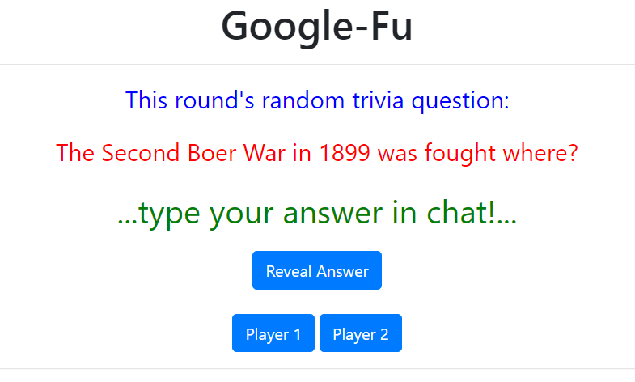
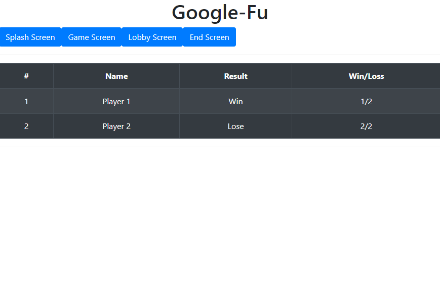

# Google Fu

## Table of contents

- [Game Description](#game-description)
- [Technologies](#technologies)
- [Launch](#launch)
- [Group Members](#group-members)
- [Screenshots](#screenshots)

## Game Description

Google Fu is a game made to be played with friends and family via Zoom (or other video confrencing applications).

One person plays the role of game-master, and will run the application locally (future versions may allow for distributed usage of the application).

The game starts by choosing two people on the call to go head-to-head as players. The game-master will load the site, revealing a random trivia fact. As soon as they read the question, both players will look up the information as fast as they can. The first person to type the answer in the chat is declared as the winner!

This app is a group project made for [CodeSHV](https://codeshv.com/) Full-Stack Web Development bootcamp.

## Technologies

- Fully React-based single-page site utilizing Routing for various game states.
- API-based trivia engine pulls new questions and answers for each game round.
- Bootstrap integrated theme allows for future customization utilizing React-Bootstrap.

## Launch

1. Clone the project to your local machine.
2. Run `npm install` on the project folder.
3. Run `npm start` on the project folder, which will launch the locally-hosted web-app.

## Group Members

- [Joseph Shields](https://github.com/JShields28) - Component styling.
- [Steve Nicksic](https://github.com/steve-nicksic) - API call research and logic.
- [Mey Birdson](https://github.com/MeyBirdsong) - Component styling.
- [Jordan Mitchell](https://github.com/jiminesta) - Component styling.
- [Joshua Luppes](https://github.com/cooljoebob64) - Product owner, React coding.
- [Keya Daniel](https://github.com/keyadaniel) - Component styling.
- Erickson White - Wireframe, product planning.

## Screenshots

